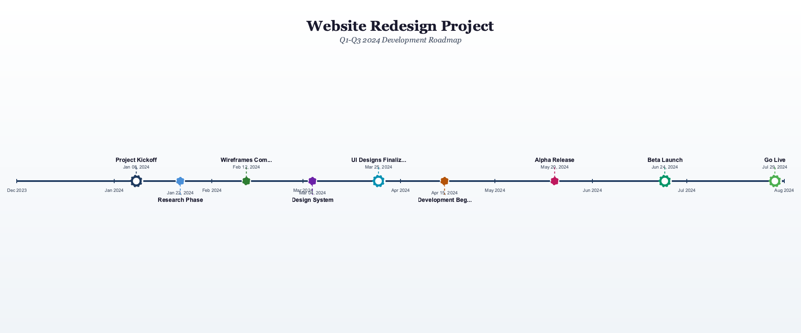
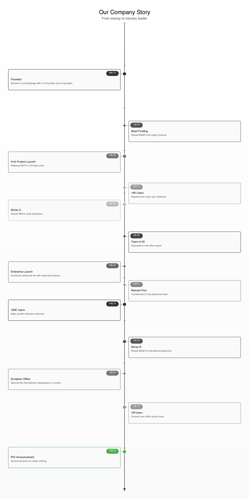
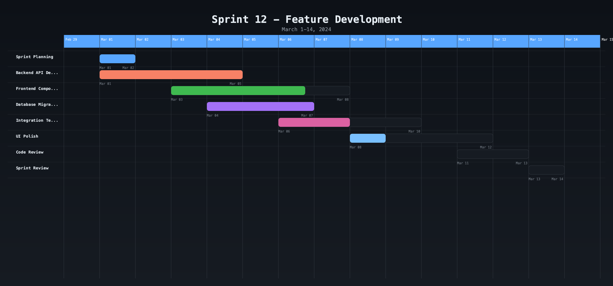
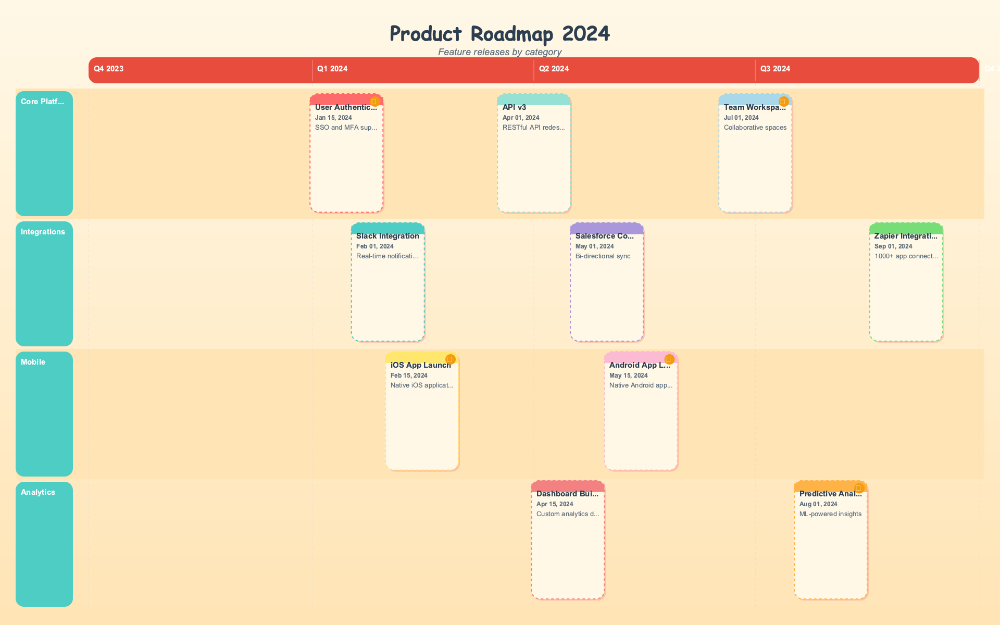
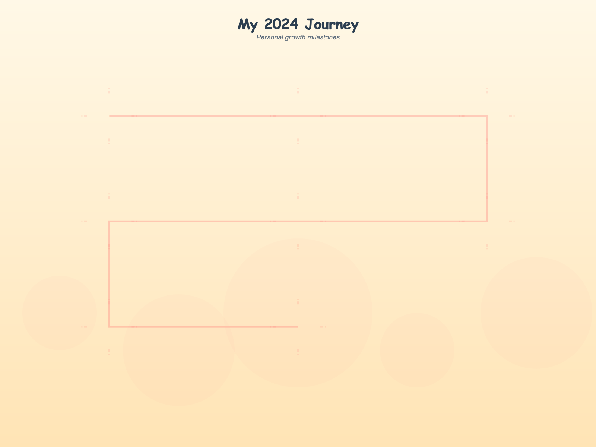
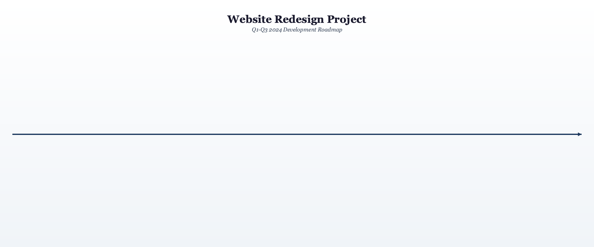
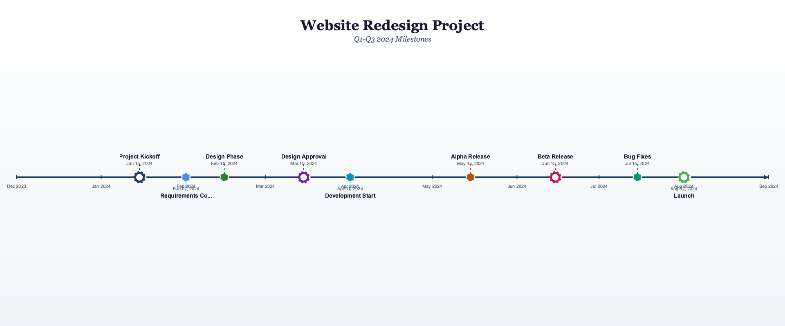
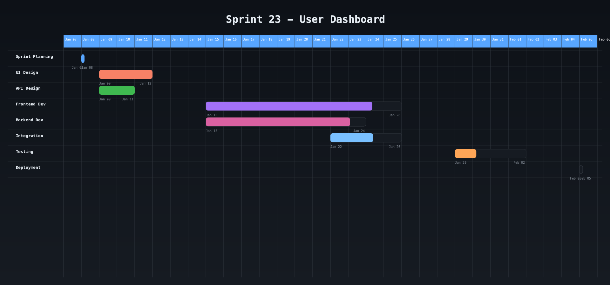

<p align="center">
  
</p>

<h1 align="center">Timeline Generator MCP</h1>

<p align="center">
  <strong>Generate beautiful timeline visualizations from milestone data</strong>
</p>

<p align="center">
  <a href="#installation">Installation</a> •
  <a href="#quick-start">Quick Start</a> •
  <a href="#examples">Examples</a> •
  <a href="#mcp-server">MCP Server</a> •
  <a href="#documentation">Documentation</a>
</p>

<p align="center">
  
  
  
  
</p>

---

A powerful CLI tool and MCP server to generate stunning timeline images and animated GIFs from milestone data. Perfect for project timelines, product roadmaps, company histories, and personal milestones.

## Features

- **5 Timeline Styles**: Horizontal, Vertical, Gantt, Roadmap, Infographic
- **4 Built-in Themes**: Minimal, Corporate, Creative, Dark
- **Multiple Output Formats**: PNG, SVG, GIF, MP4
- **Flexible Time Scales**: Hourly, Daily, Weekly, Monthly, Quarterly, Yearly
- **Animation Support**: Generate animated GIFs with configurable speed
- **Custom Colors**: Override theme colors via config or CLI
- **Transparent Background**: Export with no background for overlays
- **Smart Layout**: Auto collision detection prevents overlapping labels
- **MCP Server**: Integrate with AI assistants via Model Context Protocol

## Examples

### Horizontal Timeline (Corporate Theme)


### Vertical Timeline (Minimal Theme)


### Gantt Chart (Dark Theme)


### Product Roadmap (Creative Theme)


### Infographic Style (Creative Theme)


### Animated GIF Example


## Installation

### Prerequisites

- Python 3.10 or higher
- Cairo graphics library

#### macOS
```bash
brew install cairo
```

#### Ubuntu/Debian
```bash
sudo apt-get install libcairo2-dev
```

### Install with uv (Recommended)

```bash
git clone https://github.com/kbichave/timeline-generator-mcp.git
cd timeline-generator-mcp

uv venv
source .venv/bin/activate
uv pip install -e .
```

### Install with pip

```bash
pip install -e .
```

## Quick Start

### 1. Create a Configuration File

```bash
timeline-gen init -o my_timeline.yaml
```

### 2. Edit Your Timeline

```yaml
title: "My Project Timeline"
scale: monthly
style: horizontal
theme: corporate

milestones:
  - date: "2024-01-15"
    title: "Project Start"
    highlight: true
    
  - date: "2024-06-01"
    title: "Launch"

# Optional: Custom colors
colors:
  accent: "#FF5733"

# Optional: Text wrapping
text_wrap: true  # Set to false to disable text wrapping

output:
  format: png
  transparent: false
```

### 3. Generate the Timeline

```bash
timeline-gen generate my_timeline.yaml -o timeline.png
```

## CLI Commands

### `generate` - Generate from config file

```bash
timeline-gen generate config.yaml [OPTIONS]

Options:
  -o, --output PATH       Output file path
  -f, --format TEXT       Output format (png, svg, gif, mp4)
  -s, --style TEXT        Timeline style
  -t, --theme TEXT        Theme name
  -w, --width INTEGER     Output width
  -h, --height INTEGER    Output height
  --fps INTEGER           Frames per second for animations (default: 30)
  -d, --duration FLOAT    Animation duration in seconds (default: 5.0)
  --transparent           Use transparent background
  --accent-color TEXT     Custom accent color (e.g., #FF5733)
  --text-wrap/--no-text-wrap  Enable/disable text wrapping (default: enabled)
```

### `quick` - Quick inline generation

```bash
timeline-gen quick "2024-01-01:Start" "2024-06-01:Launch" "2024-12-01:Scale" \
  --style horizontal --theme dark -o timeline.png
```

### Other Commands

```bash
timeline-gen styles      # List available styles
timeline-gen themes      # List available themes
timeline-gen preview     # Preview configuration
timeline-gen init        # Create template file
timeline-gen version     # Show version
```

## Generate All Examples

Run the included script to generate all example outputs:

```bash
./generate_examples.sh
```

## MCP Server

Timeline Generator MCP includes a **Model Context Protocol (MCP) server** built with FastMCP for seamless integration with AI assistants like Claude, Cursor, and other agentic AI systems.

### Transport Modes

| Mode | Command | Use Case |
|------|---------|----------|
| STDIO | `timeline-mcp` | Cursor, Claude Desktop (default) |
| HTTP | `timeline-mcp-http` | Web API, persistent server |
| uvicorn | `uvicorn timeline_generator.fastmcp_server:http_app` | Production deployment |
| uvx | `uvx timeline-generator-mcp` | Zero-install |

### Setup for AI Assistants (STDIO Mode)

#### Option 1: Using uvx (Recommended - No Installation)

```json
{
  "mcpServers": {
    "timeline-generator-mcp": {
      "command": "uvx",
      "args": ["timeline-generator-mcp"]
    }
  }
}
```

Save to `~/.cursor/mcp.json` (Cursor) or `~/Library/Application Support/Claude/claude_desktop_config.json` (Claude Desktop).

#### Option 2: Local Installation

```bash
git clone https://github.com/kbichave/timeline-generator-mcp.git
cd timeline-generator-mcp
uv pip install -e .
```

```json
{
  "mcpServers": {
    "timeline-generator-mcp": {
      "command": "timeline-mcp"
    }
  }
}
```

**Restart your AI assistant** after configuration.

### HTTP Mode (Persistent Server)

For web API access or persistent deployment, use HTTP mode:

```bash
# Start HTTP server on port 8000
timeline-mcp-http

# Or with uvicorn directly (production)
uvicorn timeline_generator.fastmcp_server:http_app --host 0.0.0.0 --port 8000
```

The server will be available at:
- MCP endpoint: `http://localhost:8000/mcp`
- Health check: `http://localhost:8000/health`

### Production Deployment

#### Docker

```dockerfile
FROM python:3.11-slim

RUN apt-get update && apt-get install -y libcairo2-dev && rm -rf /var/lib/apt/lists/*

WORKDIR /app
COPY . .
RUN pip install -e .

EXPOSE 8000
CMD ["uvicorn", "timeline_generator.fastmcp_server:http_app", "--host", "0.0.0.0", "--port", "8000"]
```

```bash
docker build -t timeline-mcp .
docker run -p 8000:8000 timeline-mcp
```

#### HTTPS with Reverse Proxy

For HTTPS, use nginx or caddy as a reverse proxy:

```nginx
server {
    listen 443 ssl;
    server_name timeline.example.com;
    
    ssl_certificate /etc/ssl/certs/timeline.crt;
    ssl_certificate_key /etc/ssl/private/timeline.key;
    
    location / {
        proxy_pass http://localhost:8000;
        proxy_http_version 1.1;
        proxy_set_header Upgrade $http_upgrade;
        proxy_set_header Connection "upgrade";
    }
}
```

### Available Tools

| Tool | Description | When to Use |
|------|-------------|-------------|
| `generate_timeline` | Create timeline from TOON/YAML/JSON config | Complex timelines with custom styling |
| `quick_timeline` | Create timeline from inline milestones | Simple, fast timeline generation |
| `get_config_template` | Get starter template (TOON or YAML) | Learning the configuration format |
| `list_styles` | List available styles with descriptions | Choosing the right visual style |
| `list_themes` | List available themes | Choosing colors and aesthetics |

### TOON Format (Recommended for AI)

TOON (Token-Oriented Object Notation) reduces token usage by 30-60% compared to JSON:

```
# TOON example - compact and token-efficient
title: Project Timeline
style: horizontal
theme: corporate
milestones[3]: date title description highlight
2024-01-15 Kickoff "Project begins" true
2024-06-01 Launch "Go live" false
2024-12-01 "Year End" "Review" false
```

Equivalent YAML uses ~40% more tokens:
```yaml
title: "Project Timeline"
style: horizontal
theme: corporate
milestones:
  - date: "2024-01-15"
    title: "Kickoff"
    description: "Project begins"
    highlight: true
  # ... etc
```

### Example AI Prompts

**Simple timeline:**
> "Create a timeline showing my project phases: Planning in January, Development Feb-May, Testing in June, Launch in July"

**Gantt chart:**
> "Generate a Gantt chart for our sprint with these tasks and their progress percentages..."

**Custom styling:**
> "Make a dark-themed vertical timeline of company history from 2020 to 2024"

**Animated:**
> "Create an animated GIF timeline showing the evolution of our product"

### Tool Documentation

Each tool includes comprehensive documentation visible to AI assistants:

- **Detailed descriptions** explaining when and how to use each tool
- **Input schemas** with validation and examples
- **Error messages** with helpful suggestions
- **Templates** for quick configuration

## TOON Format Examples

The `examples/` directory includes TOON format files demonstrating the token-efficient format:

| File | Style | Description |
|------|-------|-------------|
| `project_timeline.toon` | horizontal | Website redesign project milestones |
| `company_history.toon` | vertical | TechCorp history from startup to scale |
| `sprint_gantt.toon` | gantt | Sprint 23 task tracking with progress |

### Example: TOON vs YAML

**TOON Format** (30-60% fewer tokens):
```
title: Website Redesign Project
style: horizontal
theme: corporate

milestones[4]: date title description highlight
2024-01-15 "Project Kickoff" "Initial planning" true
2024-03-15 "Design Approval" "Stakeholder sign-off" true
2024-06-15 "Beta Release" "External testing" true
2024-08-01 Launch "Public release" true

output:
  format: png
  width: 1920
  height: 800
```

**Equivalent YAML** (~40% more tokens):
```yaml
title: Website Redesign Project
style: horizontal
theme: corporate
milestones:
  - date: "2024-01-15"
    title: "Project Kickoff"
    description: "Initial planning"
    highlight: true
  - date: "2024-03-15"
    title: "Design Approval"
    description: "Stakeholder sign-off"
    highlight: true
  # ... and so on
output:
  format: png
  width: 1920
  height: 800
```

### Generate from TOON

```bash
# Generate PNG from TOON file
timeline-gen generate examples/project_timeline.toon -o output/timeline.png

# Generate animated GIF from TOON
timeline-gen generate examples/project_timeline.toon -o output/timeline.gif -f gif --fps 20 -d 4
```

### TOON Examples Output

#### From `project_timeline.toon`


#### From `sprint_gantt.toon`  


## Timeline Styles

| Style | Description | Best For |
|-------|-------------|----------|
| `horizontal` | Left-to-right with labels above/below | Project phases, event sequences |
| `vertical` | Top-to-bottom with alternating cards | Company history, long chronologies |
| `gantt` | Duration bars with progress tracking | Sprint planning, project schedules |
| `roadmap` | Swimlane layout with categories | Product roadmaps, feature planning |
| `infographic` | Creative flowing layout with icons | Personal milestones, storytelling |

## Themes

| Theme | Description |
|-------|-------------|
| `minimal` | Clean, monochrome design |
| `corporate` | Professional blue tones |
| `creative` | Bold, colorful palette |
| `dark` | Modern dark mode |

## Custom Colors

Override theme colors in your config:

```yaml
colors:
  background: "#FFFFFF"
  text: "#333333"
  accent: "#007AFF"
  secondary: "#6C757D"
  highlight: "#FFD700"
  axis: "#E0E0E0"
```

## Custom Fonts

Control font sizes for different elements:

```yaml
fonts:
  badge: 28       # Text inside milestone markers (default: theme title size)
  title: 18       # Milestone titles (default: theme label size)
  description: 14 # Descriptions (default: theme date size)
```

## Custom Badges

The `badge` field lets you customize what appears inside milestone markers (circles in infographic style, numbers in other styles):

```yaml
# YAML format
milestones:
  - date: "2025-02-01"
    badge: "Feb"          # Shows "Feb" instead of "1"
    title: "Project Start"
  - date: "2025-06-01"
    badge: "Q2"           # Shows "Q2" instead of "2"
    title: "Mid-Year Review"
```

```
# TOON format
milestones[2]: date badge title
2025-02-01 "Feb" "Project Start"
2025-06-01 "Q2" "Mid-Year Review"
```

This is especially useful for:
- **Month names**: "Jan", "Feb", "Mar"
- **Quarters**: "Q1", "Q2", "Q3", "Q4"
- **Years**: "2020", "2021", "2022"
- **Custom labels**: "MVP", "v1.0", "GA"

## Text Wrapping

Control whether long titles and descriptions wrap to multiple lines:

```yaml
text_wrap: true   # Enable wrapping (default)
text_wrap: false  # Disable wrapping - text will be truncated
```

Or via CLI:
```bash
timeline-gen generate config.yaml --no-text-wrap -o timeline.png
timeline-gen quick "2024-01:Long Title Here" --no-text-wrap
```

## Transparent Background

Export timelines with no background for overlays on slides, websites, or videos:

```yaml
output:
  format: gif        # Works with PNG and GIF
  transparent: true  # No background - just the timeline elements
```

Or via CLI:
```bash
timeline-gen generate config.yaml --transparent -o timeline.png
```

## Development

### Setup

```bash
git clone https://github.com/kbichave/timeline-generator-mcp.git
cd timeline-generator-mcp
uv venv
source .venv/bin/activate
uv pip install -e ".[dev]"
```

### Run Tests

```bash
pytest
```

## Contributing

Contributions are welcome! Please read our [Contributing Guide](CONTRIBUTING.md) and [Code of Conduct](CODE_OF_CONDUCT.md).

## License

MIT License - see [LICENSE](LICENSE) for details.
